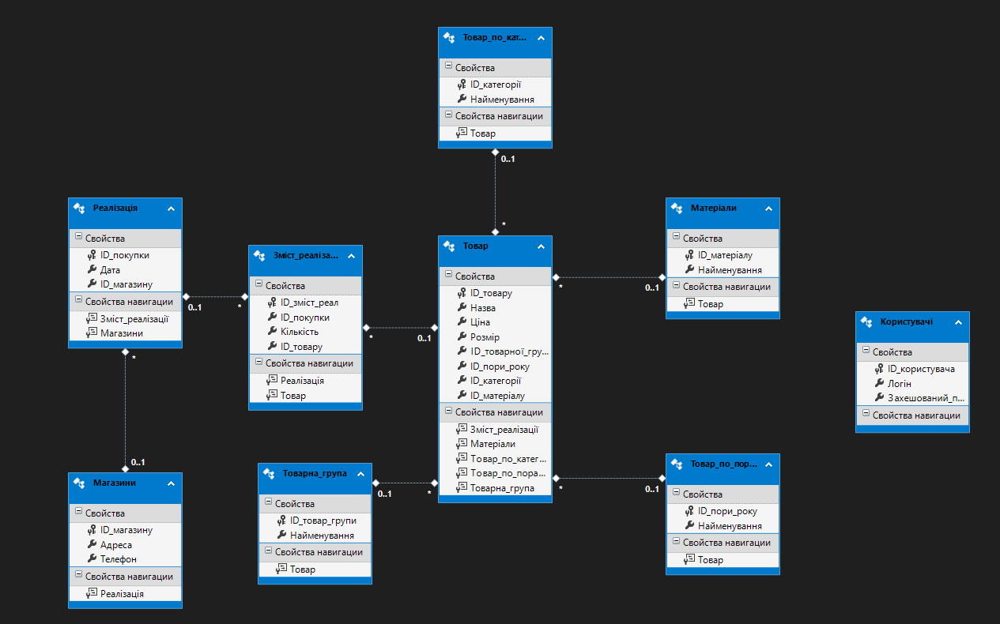
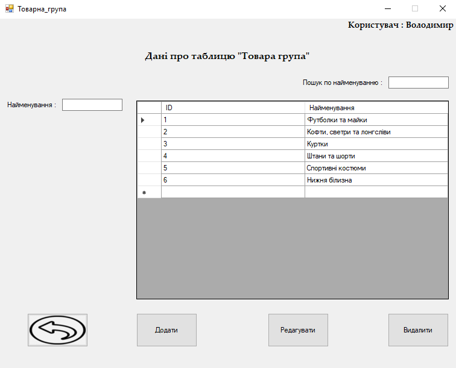
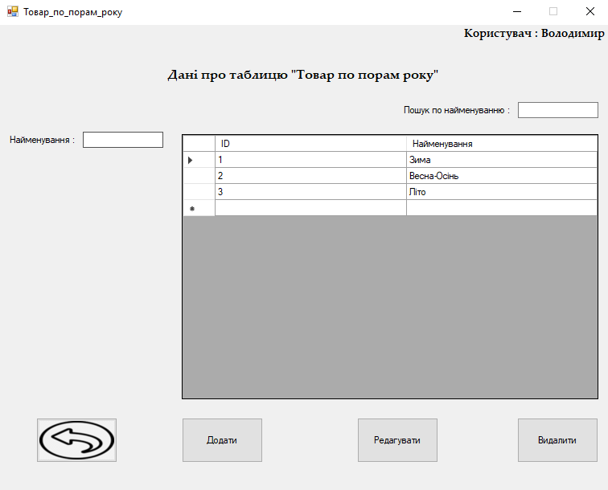

## Description
The application is a powerful tool for data management and analysis of sales. The main functions of the application include `authorization`, `selecting a data table for administration`, `viewing the current user`, and `managing data`. Users can *view*, *add*, *edit* and *delete* data, ensuring that the information in the database is up to date and complete.

Analytics functionality allows you to analyze data in detail by sales, products, categories etc., saving analytical data in Excel for further analysis. Built-in SQL queries provide high performance and accuracy, loading data into the DataGridView and performing analytical operations with minimal latency.

The application `was developed to provide` efficient data management and analysis of sales. `It solves the problem of` the need to systematize and process information about sales and products, which allows companies to make more informed decisions and optimize their operations.

## Key Features
### Authorization with additional security
The login password is encrypted and hidden under * symbols, providing an additional level of security and confidentiality.
### Displaying information about the current user
Users can easily find out information about their current account, providing control and convenience for personalizing their experience.
### Flexible selection of data for actions
The administrator form contains several data tables that allow you to select the necessary information for subsequent operations.
### Data management via built-in SQL queries
The implementation of viewing, adding, editing and deleting records is carried out using built-in SQL queries. This ensures high productivity and accuracy of operations, and also minimizes the risk of errors.
### Integrated analytics with export capability
Users can conduct detailed data analysis and save analytical information into Excel files for later sharing and further analysis.
### Error processing
All system errors that could occur were processed to ensure correct operation of the program.
### Transaction Notifications
Providing informative notifications to the user about errors and successful actions to increase understanding and ensure that all transactions are accounted for.
### User-Friendly Interface
By using Windows Forms elements such as `linkLabel`, `Label`, `TextBox`, `Button`, `MaskedTextBox`, `ComboBox`, and `dataGridView`, the application provides an attractive and intuitive interface, facilitating comfortable and efficient user interaction. 

## Used Technologies
The application was built using `C#` in `Visual Studio`, with `WinForms` chosen for the user interface due to its ease of use and rapid development capabilities. C# was selected for its widespread availability and robustness in software development, while Visual Studio provides an intuitive and efficient development environment.

To manage data, the application utilizes `SQL Server LocalDB`, facilitating easy deployment and testing. `Entity Framework` abstracts database operations, simplifying code and enhancing maintainability. `ADO.NET` offers direct database access and flexible data management capabilities.

Database schema design is handled with `SQL Server Data Tools (SSDT)`, integrated into Visual Studio. SSDT enables convenient visual modeling of database structure and efficient management of tables, keys, and relationships.

Dependencies and external components are managed through `NuGet`, ensuring quick integration and up-to-date components throughout development. NuGet simplifies the process of adding, updating, and removing libraries and dependencies essential for application development.

## Limitations and settings
To ensure the security and ease of use of the application, various software settings and restrictions have been applied. For example, the application form was placed in the center of the screen, providing a convenient layout for the user. Additionally, the size of the form has been fixed to prevent accidental changes to its appearance, and dragging the form has been disabled.

To improve security, the "Expand" button has been hidden so that all elements on the form are positioned correctly and make them easier to work with. The application also actively handles system errors, guaranteeing stable and reliable operation, and also provides the user with informative messages about emerging problems for a quick response and improved user experience.

Also, during authorization, after entering an incorrect password, the input field is automatically cleared, providing convenience to the user when trying to log in again and preventing possible input errors.

## Application overview

### <ins>Database overview</ins>

#### Conceptual Model

This conceptual database model describes the main entities and their relationships in a product supply and sales management system. The model presents several entities and their relationships:

- **Client (Клієнт):**
  - Represents the end consumer or purchaser of goods.
  - Associated with the entity “Sales of goods” (Реалізація товару) in a one-to-many relationship, which means that one customer can make many purchases.

- **Sales of goods (Реалізація товару):**
  - Reflects the process of selling a product to a client.
  - Linked to the Customer entity in a many-to-one relationship (N:1), indicating that each sale relates to a specific customer.
  - Linked to the Product entity in a many-to-one relationship (N:1), meaning that multiple sales can be associated with the same product.

- **Product (Товар):**
  - Represents a product that is sold to a customer and supplied by a supplier.
  - Associated with the entity “Sales of goods” (Реалізація товару) in a one-to-many relationship, which means that one product can be sold in many sales.
  - Associated with the entity “Delivery of goods” (Постачання товару) in a “one to many” relationship, which means that one item can be supplied as part of many deliveries.

- **Delivery of goods (Постачання товару):**
  - Reflects the process of delivery of goods from the supplier.
  - Linked to the Item entity in a many-to-one relationship (N:1), indicating that each delivery relates to a specific item.
  - Linked to the Supplier entity (Постачальник) in a many-to-one relationship (N:1), which means that multiple deliveries can be linked to the same supplier.

- **Supplier (Постачальник):**
  - Represents the company or person who supplies the goods.
  - Associated with the entity “Delivery of goods” (Постачання товару) in a “one to many” relationship, which means that one supplier can make many deliveries.

**Relationships between entities:**
- Customer and Product Sales: One customer can make many purchases, but each purchase is associated with one customer.
- Product Sales and Product: Multiple sales may involve the same product, but each sale is associated with one specific product.
- Item and Item Supply: One item may be supplied within many deliveries, but each delivery is associated with one specific item.
- Item Supply and Supplier: Multiple deliveries may be made by one supplier, but each supply is associated with one specific supplier.

This model provides an overview of how customers, products, supplies, and suppliers are interconnected in the system.

  
<b>Screenshot</b>

  
  |  | 
  | :--: | 
  | *Conceptual Model* |

#### Logic Model

This logical database model describes the data structure for the inventory and sales system. The model contains several interconnected tables:

- **Product group (Товарна група):**
  - Product group ID (PK) - a unique identifier of the product group.
  - Name - the name of the product group.

- **Product (Товар):**
  - Product ID (PK) - a unique identifier of the product.
  - Name - the name of the product.
  - Price - the price of the product.
  - Size - the size of the product.
  - Product group ID (FK) - link to the product group identifier.
  - Pori Roku ID (FK) - a link to the season identifier.
  - Category ID (FK) - link to the product category identifier.
  - Material ID (FK) - link to the material identifier.

- **Seasons (Пори року):**
  - Pori Roku ID (PK) is a unique identifier for the season.
  - Name - the name of the season.

- **Product categories (Товар по категоріям):**
  - Category ID (PK) – unique identifier of the category.
  - Name - the name of the category.

- **Materials (Матеріали):**
  - Material ID (PK) – unique identifier of the material.
  - Name - name of the material.

- **Sales of goods (Реалізація товару):**
  - Purchase ID (PK) - unique identifier for the purchase.
  - Date—date of purchase.
  - Store ID (FK) - link to the store identifier.

- **Contents of the implementation (Зміст реалізації):**
  - Purchase ID (PK, FK) - link to the purchase ID.
  - Quantity - quantity of goods.
  - Product ID (PK, FK) - link to the product identifier.

- **Shops (Магазини):**
  - Store ID (PK) - a unique identifier for the store.
  - Addresses - store address.
  - Phone - store phone number.

**In this model:**
- Primary keys (PK) are used to uniquely identify records in tables.
- Foreign keys (FKs) establish relationships between tables, ensuring data integrity.
- Tables have one-to-many or many-to-many relationships, reflecting realistic scenarios for using data in the system.

This structure allows you to effectively manage information about products, categories, materials, seasons, stores and sales, ensuring data integrity and consistency.

  
<b>Screenshot</b>

  
  |  | 
  | :--: | 
  | *Logic Model* |

#### Class Model

This class model describes the structure of data and their relationships in the system of accounting for goods, their categories, materials, sales and other aspects. The model contains the following classes:

**Implementation (Реалізація):**
- Properties:
  - Purchase ID - a unique identifier for the purchase.
  - Date - date of purchase.
  - Store ID - link to the store ID.
- Navigation properties:
  - Implementation place - a link to the contents of the implementation.
  - Stores - link to the store where the purchase was made.

**Contents of the implementation (Зміст реалізації):**
- Properties:
  - Implementation place ID is a unique identifier of the implementation content.
  - Purchase ID - link to the purchase ID.
  - Quantity - quantity of goods.
  - Product ID - link to the product identifier.
- Navigation properties:
  - Implementation - link to the implementation.
  - Product - link to the product.

**Product (Товар):**
- Properties:
  - Product ID - a unique identifier for the product.
  - Name - the name of the product.
  - Price - the price of the product.
  - Size - the size of the product.
  - Product group ID - link to the product group identifier.
  - Season ID - link to the identifier of the season.
  - Category ID - link to the category identifier.
  - Material ID - link to the material identifier.
- Navigation properties:
  - Product group - link to the product group.
  - Materials - link to materials.
  - Product by category - link to the product category.
  - Pori roku product is a reference to the time of year.
  - Implementation location - link to the content of the implementation.

**Shops (Магазини):**
- Properties:
  - Store ID - unique identifier of the store.
  - Addresses - store address.
  - Phone - store phone number.
- Navigation properties:
  - Implementation - link to the implementation.

**Product group (Товарна група):**
- Properties:
  - Product group ID - a unique identifier of the product group.
  - Name - the name of the product group.
- Navigation properties:
  - Product - link to products in this group.

**Product categories (Товар по категоріям):**
- Properties:
  - Category ID - unique identifier of the category.
  - Name - the name of the category.
- Navigation properties:
  - Product - link to products in this category.

**Materials (Матеріали):**
- Properties:
  - Material ID - unique identifier of the material.
  - Name - name of the material.
- Navigation properties:
  - Product - a link to products from this material.

**Seasons (Пори року):**
- Properties:
  - Season ID is a unique identifier for the season.
  - Name - the name of the season.
- Navigation properties:
  - Product - a link to products associated with this time of year.

**Users (Користувач):**
- Properties:
  - User ID is a unique user identifier.
  - Login - user login.
  - Password - user password.
- Navigation properties:
  - none.

This model describes how entities are related to each other through navigation properties and also includes key attributes for each entity. It provides a structured view of data and its relationships, which helps in database development and management.

  
<b>Screenshot</b>

  
  |  | 
  | :--: | 
  | *Class Model* |

#### Database

This section presents the database, including tables, their contents and key fields.

  
<b>Screenshot</b>

  
  |  | 
  | :--: | 
  | *Database* |

### <ins>Starting the program</ins>

#### Install DB

To run the program you will need Microsoft SQL Server LocalDB. If it is already installed on your computer, the installer window will not appear. However, if LocalDB is missing, you will need to download it to your computer.

  
<b>Screenshot</b>

  
  |  | 
  | :--: | 
  | *Install DB* |

### <ins>Authorization and data selection</ins>

#### Login

  
<b>Screenshot</b>

  
  |  | 
  | :--: | 
  | *Login* |

When starting the program, you must go through authorization, for which two fields are provided: login and password. If you enter incorrect credentials or incomplete information (either just the login or just the password), an error window will appear containing the following messages.

#### Exception when logging in with empty fields

  
<b>Screenshot</b>

  
  |  | 
  | :--: | 
  | *Exception when logging in with empty fields* |

#### Exception when logging in with invalid data

  
<b>Screenshot</b>

  
  |  | 
  | :--: | 
  | *Exception when logging in with invalid data* |

#### Administration Form

  
<b>Screenshot</b>

  
  |  | 
  | :--: | 
  | *Administration Form* |

After successful authorization, you will see in the upper right corner the current account under which you are logged in, and you will also be given a choice of the necessary information to carry out various actions with it. In addition, you can navigate to sales analytics and other data to analyze it or save it to a file.

*However, if the data is not selected and you try to open it, you will see an error message indicating that the data was not selected.*

### <ins>Overview of Form Data</ins>

#### Users

  
<b>Screenshot</b>

  
  |  | 
  | :--: | 
  | *Users* |

#### Shops

  
<b>Screenshot</b>

  
  |  | 
  | :--: | 
  | *Shops* |

#### Product Group

  
<b>Screenshot</b>

  
  |  | 
  | :--: | 
  | *Product Group* |

#### Sales

  
<b>Screenshot</b>

  
  |  | 
  | :--: | 
  | *Sales* |

#### Sales Composition

  
<b>Screenshot</b>

  
  |  | 
  | :--: | 
  | *Sales Composition* |

#### Materials

  
<b>Screenshot</b>

  
  |  | 
  | :--: | 
  | *Materials* |

#### Product by Season

  
<b>Screenshot</b>

  
  |  | 
  | :--: | 
  | *Product by Season* |

#### Product by Category

  
<b>Screenshot</b>

  
  |  | 
  | :--: | 
  | *Product by Category* |

#### Product

  
<b>Screenshot</b>

  
  |  | 
  | :--: | 
  | *Product* |

### <ins>Actions with data</ins>

**You will be able to view, add, edit and delete data.**
- To view the data, just select the ones you need from those available on the Administrator form and go to them. You will then be able to see the current data in a specific area.
- To add new records, simply enter the appropriate data in the fields with the provided names and click the "Add" button.
- To edit data, select a row and make changes to the appropriate fields, then click the "Edit" button.
- To delete entries, select the desired row and click the "Delete" button.

### <ins>Exceptions and notifications</ins>

- **When adding:**

#### Exception when adding an empty entry

  
<b>Screenshot</b>

  
  |  | 
  | :--: | 
  | *Exception when adding an empty entry* |

#### Exception when adding an existing entry

  
<b>Screenshot</b>

  
  |  | 
  | :--: | 
  | *Exception when adding an existing entry* |

#### Notification of Successful Entry Addition

  
<b>Screenshot</b>

  
  |  | 
  | :--: | 
  | *Notification of Successful Entry Addition* |

- **When editing:**

#### Exception when editing with empty field

  
<b>Screenshot</b>

  
  |  | 
  | :--: | 
  | *Exception when editing with empty field* |

#### Notification when editing without changes

  
<b>Screenshot</b>

  
  |  | 
  | :--: | 
  | *Notification when editing without changes* |

#### Notification of Successful Entry Editing

  
<b>Screenshot</b>

  
  |  | 
  | :--: | 
  | *Notification of Successful Entry Editing* |

- **When deleting:**

#### Exception when deleting the account under which you are currently working

  
<b>Screenshot</b>

  
  |  | 
  | :--: | 
  | *Exception when deleting the account under which you are currently working* |

#### Exception when deleting last user

  
<b>Screenshot</b>

  
  |  | 
  | :--: | 
  | *Exception when deleting last user* |

#### Exception when a new line is removed or when an entry is not selected

  
<b>Screenshot</b>

  
  |  | 
  | :--: | 
  | *Exception when a new line is removed or when an entry is not selected* |

#### Notification Removing Linked Records

  
<b>Screenshot</b>

  
  |  | 
  | :--: | 
  | *Exception Notification Linked Records* |

#### Deletion Confirmation

  
<b>Screenshot</b>

  
  |  | 
  | :--: | 
  | *Deletion Confirmation* |

#### Notification of Successful Record Deletion

  
<b>Screenshot</b>

  
  |  | 
  | :--: | 
  | *Notification of Successful Record Deletion* |

### <ins>Search</ins>

#### Search

  
<b>Screenshot</b>

  
  |  | 
  | :--: | 
  | *Search* |

Users can benefit from stricter criteria restrictions when working with each form of data. Just enter the required details in the search field and you will get complete information about the relevant records.

*Also below are warnings that may appear when searching on some data forms:*

#### Exception when searching by ID

  
<b>Screenshot</b>

  
  |  | 
  | :--: | 
  | *Exception when searching by ID* |

#### Exception when searching by date

  
<b>Screenshot</b>

  
  |  | 
  | :--: | 
  | *Exception when searching by date* |

### <ins>Sorting</ins>

Users have the ability to sort any data in ascending or descending order. Simply click on the column header to select the sort order you want.

*Below are errors when sorting data::*

- #### Sorting products by price in ascending order

  
<b>Screenshot</b>

  
  |  | 
  | :--: | 
  | *Sorting products by price in ascending order* |

- #### Sorting products by price in descending order

  
<b>Screenshot</b>

  
  |  | 
  | :--: | 
  | *Sorting products by price in descending order* |

### <ins>Analytics</ins>

#### Analytics

  
<b>Screenshot</b>

  
  |  | 
  | :--: | 
  | *Analytics* |

The analytical form provides a variety of analytical data about products, stores, categories, and more. Here you can view information, use the search function and export the data you need to an Excel file.

*An example of analytical data output is given below:*

- #### Save Analytics

  
<b>Screenshot</b>

  
  |  | 
  | :--: | 
  | *Save Analytics* |

- #### Excel with Analytics

  
<b>Screenshot</b>

  
  |  | 
  | :--: | 
  | *Excel with Analytics* |

- #### Each table in a separate sheet

  
<b>Screenshot</b>

  
  |  | 
  | :--: | 
  | *Each table in a separate sheet* |

- #### Example 1 of Saved Data

  
<b>Screenshot</b>

  
  |  | 
  | :--: | 
  | *Example of Saved Data* |

- #### Example 2 of Saved Data 

  
<b>Screenshot</b>

  
  |  | 
  | :--: | 
  | *Example of Saved Data 2* |

### <ins>Closing</ins>

#### Program Completion Confirmation

  
<b>Screenshot</b>

  
  |  | 
  | :--: | 
  | *Program Completion Confirmation* |

## Project setup
On Windows platform: 
*Download [archive](./Release_exe.rar) which has all needed application components. The application can be started by opening the `.exe` file.*

`Note:` When you start the program, you must install SQL Server LocalDB on your computer. If it is not installed, an installer window will automatically open, giving you the opportunity to install the required component.
